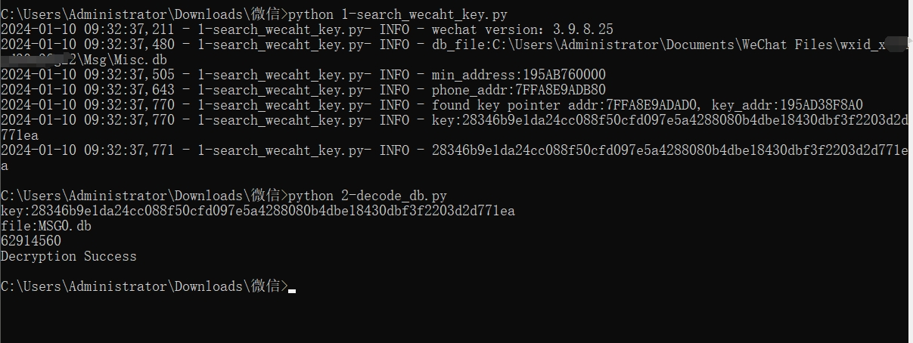
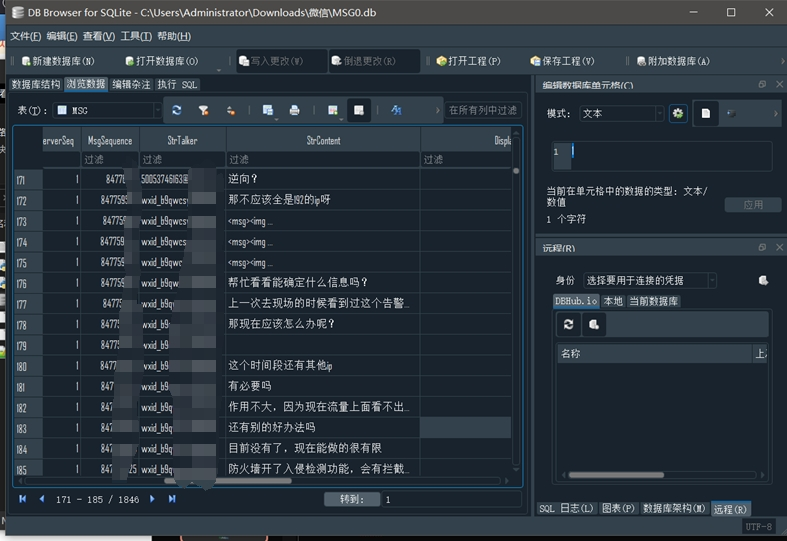

## 微信sqlite解密
<a href="https://github.com/adysec/wechat_sqlite/stargazers"></a>
<a href="https://github.com/adysec/wechat_sqlite/network/members"></a>
<a href="https://github.com/adysec/wechat_sqlite/issues"></a>

## 说明

目前有更好的项目`https://github.com/0xlane/wechat-dump-rs`，原先该项目无获取key功能和源码，仅支持下载可执行文件，因此建立了本仓库，现在对方提供了`wechat-dump-rs.exe`源码，并支持4.0版本微信

## 使用方法

安装库

```bash
pip install -r requirements.txt
```

登录状态的微信获取key

```bash
python 1-search_wecaht_key.py
# OR
wechat-dump-rs.exe
```

复制MSG0.db到当前目录，通过key解密

```bash
python 2-decode_db.py
```

效果如图




